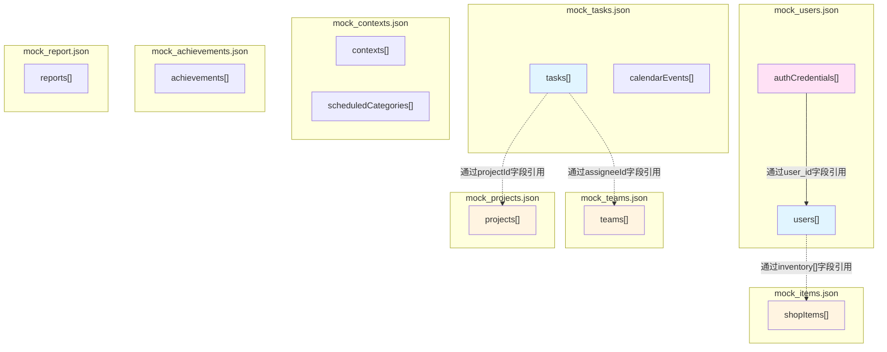

# Mock数据文档

本文档详细记录了 Coreterra 项目中所有前后端的 mock 数据位置和内容。

## 概述

项目中的 mock 数据已从代码中抽取出来，分类存储在8个独立的JSON文件中。所有数据读取都通过 `backend/app/services/data_service.py` 作为唯一入口，确保数据访问的统一性和可维护性。

**重要原则**：
- 所有数据读取必须通过 `data_service.py` 作为唯一入口
- 禁止在其他服务中直接读取JSON文件
- 前端通过API调用获取数据，不再包含硬编码的mock数据

---

## 数据文件结构

所有mock数据文件位于 `backend/data/` 目录下：

```
backend/data/
  ├── mock_users.json          # 用户数据和认证信息
  ├── mock_teams.json          # 团队成员数据
  ├── mock_tasks.json           # 任务和日历事件数据
  ├── mock_projects.json        # 项目数据
  ├── mock_items.json           # 商店物品数据
  ├── mock_achievements.json    # 成就数据
  ├── mock_contexts.json        # 上下文和计划时间分类数据
  └── mock_report.json          # 报告数据
```

---

## 后端 Mock 数据

### 1. 用户数据和认证信息

**位置**: `backend/data/mock_users.json`

**用途**: 存储用户信息和登录认证凭据。

**数据结构**:
```json
{
  "users": [
    {
      "id": 1,
      "name": "Alex Morgan",
      "avatar": "...",
      "role": "Designer",
      "level": 14,
      "currentXP": 350,
      "maxXP": 500,
      "gold": 1250,
      "streak": 14,
      "inventory": [],
      "stats": {
        "focus": 15,
        "execution": 12,
        "planning": 8,
        "teamwork": 10,
        "expertise": 9,
        "streak": 14
      }
    }
  ],
  "authCredentials": [
    {
      "username": "alex",
      "password": "test",
      "user_id": 1
    }
  ]
}
```

**字段说明**:
- `users`: 用户数据数组
  - `id`: 用户ID (number)
  - `name`: 用户名称 (string)
  - `avatar`: 头像URL (string)
  - `role`: 角色 (string)
  - `level`: 等级 (number)
  - `currentXP`: 当前经验值 (number)
  - `maxXP`: 最大经验值 (number)
  - `gold`: 金币数量 (number)
  - `streak`: 连续天数 (number)
  - `inventory`: 物品清单 (array)
  - `stats`: 统计数据对象
- `authCredentials`: 认证凭据数组
  - `username`: 用户名 (string)
  - `password`: 密码（明文，用于MVP阶段）(string)
  - `user_id`: 关联的用户ID (number)

**使用方式**: 
- 通过 `data_service.get_all("users")` 获取用户列表
- 通过 `data_service.get_auth_credentials(username)` 获取认证信息
- `auth_service.py` 通过 `data_service` 获取认证信息，不再直接读取文件

**当前数据**: 1 个用户，1 组认证凭据

---

### 2. 团队成员数据

**位置**: `backend/data/mock_teams.json`

**用途**: 存储团队成员信息，用于任务分配和团队管理。

**数据结构**:
```json
{
  "teams": [
    {
      "id": 1,
      "name": "Sarah Jenkins",
      "role": "Frontend",
      "status": "Available",
      "capacity": 35,
      "avatar": "..."
    }
  ]
}
```

**字段说明**:
- `id`: 成员ID (number)
- `name`: 成员姓名 (string)
- `role`: 角色 (string)
- `status`: 状态 (string) - 可能的值: "Available", "Busy"
- `capacity`: 工作容量百分比 (number, 0-100)
- `avatar`: 头像URL (string)

**当前数据**: 3 个团队成员

**API端点**: `GET /api/teams`

---

### 3. 任务和日历事件数据

**位置**: `backend/data/mock_tasks.json`

**用途**: 存储任务数据和日历事件数据。

**数据结构**:
```json
{
  "tasks": [
    {
      "id": 1,
      "title": "Fix navigation z-index issue",
      "status": "organized",
      "createdAt": "2023-10-24T10:30:00",
      "priority": true,
      "xpReward": 0,
      "projectId": "p1",
      "difficulty": "Hard",
      "estimatedTime": "2h",
      "subtasks": [...],
      "description": null
    }
  ],
  "calendarEvents": [
    {
      "id": 1,
      "date": 1,
      "type": "appointment",
      "time": "10:00 AM",
      "title": "Team Sync",
      "color": "bg-blue-50",
      "border": "border-blue-500"
    }
  ]
}
```

**字段说明**:

**Tasks**:
- `id`: 任务ID (number)
- `title`: 任务标题 (string)
- `status`: 任务状态 (string) - 可能的值: "inbox", "organized", "clarified", "waiting", "scheduled", "completed", "trash"
- `createdAt`: 创建时间 (string, ISO 8601格式)
- `priority`: 是否优先 (boolean)
- `xpReward`: XP奖励 (number)
- `projectId`: 关联项目ID (string, 可选)
- `difficulty`: 难度等级 (string, 可选) - "Easy", "Med", "Hard"
- `estimatedTime`: 预估时间 (string, 可选) - "15m", "30m", "1h", "2h+"
- `subtasks`: 子任务列表 (array, 可选)
- `description`: 任务描述 (string | null, 可选)

**CalendarEvents**:
- `id`: 事件ID (number)
- `date`: 日期（月份中的第几天）(number, 1-31)
- `type`: 事件类型 (string) - 可能的值: "appointment", "soft", "deadline"
- `time`: 时间 (string, 可选) - 仅用于 appointment 类型
- `title`: 事件标题 (string)
- `color`: 背景颜色类名 (string, Tailwind CSS)
- `border`: 边框样式类名 (string, Tailwind CSS)

**当前数据**: 7 个任务，4 个日历事件

**API端点**: 
- `GET /api/tasks` - 获取任务列表
- `GET /api/tasks/calendar/events` - 获取日历事件列表

---

### 4. 项目数据

**位置**: `backend/data/mock_projects.json`

**用途**: 存储项目信息。

**数据结构**:
```json
{
  "projects": [
    {
      "id": "p1",
      "title": "Website Redesign",
      "progress": 65,
      "totalTasks": 10,
      "completedTasks": 6
    }
  ]
}
```

**字段说明**:
- `id`: 项目ID (string)
- `title`: 项目标题 (string)
- `progress`: 进度百分比 (number, 0-100)
- `totalTasks`: 总任务数 (number)
- `completedTasks`: 已完成任务数 (number)

**当前数据**: 2 个项目

**API端点**: `GET /api/projects`

---

### 5. 商店物品数据

**位置**: `backend/data/mock_items.json`

**用途**: 存储商店物品信息。

**数据结构**:
```json
{
  "shopItems": [
    {
      "id": "item_xp_potion",
      "name": "2x XP Potion",
      "cost": 350,
      "type": "consumable"
    }
  ]
}
```

**字段说明**:
- `id`: 物品ID (string)
- `name`: 物品名称 (string)
- `cost`: 价格 (number)
- `type`: 物品类型 (string) - 可能的值: "consumable", "cosmetic"

**当前数据**: 2 个商店物品

**API端点**: `GET /api/gamification/shop`

---

### 6. 成就数据

**位置**: `backend/data/mock_achievements.json`

**用途**: 存储成就系统数据。

**数据结构**:
```json
{
  "achievements": [
    {
      "id": 1,
      "title": "Inbox Zero",
      "desc": "Cleared Inbox 5 days in a row",
      "icon": "military_tech",
      "color": "text-yellow-500",
      "bg": "bg-yellow-50",
      "border": "border-yellow-100",
      "unlocked": true
    }
  ]
}
```

**字段说明**:
- `id`: 成就ID (number)
- `title`: 成就标题 (string)
- `desc`: 成就描述 (string)
- `icon`: Material Icons 图标名称 (string)
- `color`: 文字颜色类名 (string, Tailwind CSS)
- `bg`: 背景颜色类名 (string, Tailwind CSS)
- `border`: 边框颜色类名 (string, Tailwind CSS)
- `unlocked`: 是否已解锁 (boolean)

**当前数据**: 6 个成就（3个已解锁，3个未解锁）

**API端点**: `GET /api/gamification/achievements`

---

## 数据服务架构

### DataService (统一数据入口)

**位置**: `backend/app/services/data_service.py`

**职责**: 作为所有数据读取的唯一入口点，管理所有JSON文件的加载和保存。

**主要方法**:
- `get_all(collection: str)`: 获取集合中的所有项
- `get_by_id(collection: str, item_id: Any)`: 根据ID获取项
- `create(collection: str, item: Dict)`: 创建新项
- `update(collection: str, item_id: Any, updates: Dict)`: 更新项
- `delete(collection: str, item_id: Any)`: 删除项
- `filter(collection: str, predicate: callable)`: 过滤项
- `get_auth_credentials(username: str)`: 获取认证凭据

**文件映射**:
- `users`, `authCredentials` → `mock_users.json`
- `tasks`, `calendarEvents` → `mock_tasks.json`
- `projects` → `mock_projects.json`
- `shopItems` → `mock_items.json`
- `achievements` → `mock_achievements.json`
- `teams` → `mock_teams.json`
- `contexts`, `scheduledCategories` → `mock_contexts.json`
- `reports` → `mock_report.json`

---

### AuthService (认证服务)

**位置**: `backend/app/services/auth_service.py`

**变更**: 
- 已移除硬编码的 `HARDCODED_USER` 常量
- 通过 `data_service.get_auth_credentials(username)` 获取认证信息
- 所有认证数据读取都通过 `data_service` 统一入口

**认证流程**:
1. `authenticate_user(username, password)` 被调用
2. 通过 `data_service.get_auth_credentials(username)` 获取凭据
3. 验证密码（支持明文密码和哈希密码）
4. 返回用户信息

---

## 前端数据访问

### API客户端

**位置**: `frontend/src/lib/api.ts`

**新增API**:
- `teamsAPI.getAll()`: 获取团队成员列表
- `calendarAPI.getEvents()`: 获取日历事件列表
- `contextsAPI.getAll()`: 获取上下文列表
- `contextsAPI.getScheduledCategories()`: 获取计划时间分类列表
- `reportsAPI.getAll(type?)`: 获取所有报告（支持类型过滤）
- `reportsAPI.getDaily()`: 获取每日报告

**类型定义**:
```typescript
export interface TeamMember {
  id: number;
  name: string;
  role: string;
  status: string;
  capacity: number;
  avatar: string;
}

export interface CalendarEvent {
  id: number;
  date: number;
  type: string;
  time?: string;
  title: string;
  color: string;
  border: string;
}

export interface Report {
  id: number;
  type: string;
  title: string;
  content: string;
  icon: string;
  date: string;
  period: string;
}
```

---

### 前端组件变更

#### OrganizePage
- **移除**: 硬编码的 `teamMembers` 数组
- **新增**: 通过 `teamsAPI.getAll()` 从API获取数据
- **位置**: `frontend/src/pages/OrganizePage.tsx`

#### CalendarPage
- **移除**: 硬编码的 `events` 数组
- **新增**: 通过 `calendarAPI.getEvents()` 从API获取数据
- **位置**: `frontend/src/pages/CalendarPage.tsx`

#### OrganizePage (更新)
- **移除**: 硬编码的 `contexts` 和 `scheduledCategories` 数组
- **新增**: 通过 `contextsAPI.getAll()` 和 `contextsAPI.getScheduledCategories()` 从API获取数据
- **位置**: `frontend/src/pages/OrganizePage.tsx`

#### ReviewPage
- **移除**: 硬编码的已完成任务示例数据、协作数据和Daily Insight报告文本
- **新增**: 
  - 从实际任务数据中过滤已完成任务
  - 通过 `teamsAPI.getAll()` 获取协作数据
  - 通过 `reportsAPI.getDaily()` 获取每日报告数据
- **位置**: `frontend/src/pages/ReviewPage.tsx`

#### HomePage
- **移除**: 硬编码的上下文显示文本
- **新增**: 通过 `contextsAPI.getAll()` 获取实际上下文数据并计算显示
- **位置**: `frontend/src/pages/HomePage.tsx`

---

## 数据使用方式说明

### 后端数据加载流程

1. **启动时加载**: 
   - `DataService` 在初始化时自动加载所有JSON文件
   - 数据缓存在内存中以提高性能

2. **运行时访问**:
   - 通过 `data_service` 全局实例访问
   - 所有 CRUD 操作会自动保存到对应的JSON文件

3. **数据持久化**:
   - 所有修改会实时写入对应的JSON文件
   - 每个集合对应一个独立的JSON文件

### 前端数据使用

1. **团队成员数据**: 
   - 通过 `teamsAPI.getAll()` 获取
   - 在 `OrganizePage` 组件中使用

2. **日历事件数据**: 
   - 通过 `calendarAPI.getEvents()` 获取
   - 在 `CalendarPage` 组件中使用

3. **上下文数据**: 
   - 通过 `contextsAPI.getAll()` 获取
   - 在 `OrganizePage` 和 `HomePage` 组件中使用

4. **计划时间分类数据**: 
   - 通过 `contextsAPI.getScheduledCategories()` 获取
   - 在 `OrganizePage` 组件中使用

5. **报告数据**: 
   - 通过 `reportsAPI.getDaily()` 获取每日报告
   - 在 `ReviewPage` 组件中使用

6. **其他数据**: 
   - 通过相应的API端点获取
   - 所有数据都通过API调用，不再有硬编码

---

## 注意事项

1. **生产环境迁移**:
   - 所有 mock 数据应在生产环境中替换为真实的数据库
   - 后端应使用数据库（如 PostgreSQL, MySQL）替代 JSON 文件
   - 前端应继续通过 API 调用获取数据

2. **安全性**:
   - 当前认证信息使用明文密码存储（仅用于MVP阶段）
   - 生产环境必须使用密码哈希存储
   - JWT secret key 应使用环境变量，不要硬编码

3. **数据一致性**:
   - 后端 JSON 文件中的数据可能被运行时修改
   - 建议定期备份或使用版本控制跟踪变化
   - 前端数据通过API实时获取，保持同步

4. **数据格式**:
   - 所有JSON文件使用 UTF-8 编码
   - 日期时间使用 ISO 8601 格式
   - ID 类型可能混合使用 number 和 string，需要注意类型转换

5. **扩展性**:
   - 添加新的数据类型时，需要在 `DataService` 的 `_file_map` 中注册
   - 前端添加新功能时，应通过API获取数据，不要硬编码

6. **统一数据入口**:
   - **重要**: 所有数据读取必须通过 `data_service.py` 作为唯一入口
   - 禁止在其他服务中直接读取JSON文件
   - 这确保了数据访问的统一性和可维护性

---

## 总结

| 数据类型 | 文件位置 | 数量 | API端点 | 用途 |
|---------|---------|------|---------|------|
| Users | `backend/data/mock_users.json` | 1 | `/api/users/me` | 用户信息和游戏化数据 |
| Auth Credentials | `backend/data/mock_users.json` | 1 | N/A (内部使用) | 登录认证 |
| Tasks | `backend/data/mock_tasks.json` | 7 | `/api/tasks` | 任务管理数据 |
| Calendar Events | `backend/data/mock_tasks.json` | 4 | `/api/tasks/calendar/events` | 日历事件展示 |
| Projects | `backend/data/mock_projects.json` | 2 | `/api/projects` | 项目管理数据 |
| ShopItems | `backend/data/mock_items.json` | 2 | `/api/gamification/shop` | 商店物品数据 |
| Achievements | `backend/data/mock_achievements.json` | 6 | `/api/gamification/achievements` | 成就系统数据 |
| Team Members | `backend/data/mock_teams.json` | 3 | `/api/teams` | 团队成员展示 |
| Contexts | `backend/data/mock_contexts.json` | 6 | `/api/contexts` | 任务上下文分类 |
| Scheduled Categories | `backend/data/mock_contexts.json` | 5 | `/api/contexts/scheduled/categories` | 计划时间分类 |
| Reports | `backend/data/mock_report.json` | 1 | `/api/reports` | 报告和洞察数据 |

---

## 数据依赖关系

本节详细说明了各个mock数据文件中元素之间的引用关系。

### 依赖关系图



**图例说明**:
- 实线箭头 `-->`: 同文件内的引用关系（从引用者指向被引用者）
- 虚线箭头 `-.->`: 跨文件的引用关系（从引用者指向被引用者）
- 蓝色背景 (`fill:#e1f5ff`): 被引用的数据集合（users, tasks）
- 黄色背景 (`fill:#fff4e1`): 被引用的目标数据集合（teams, projects, shopItems）
- 粉色背景 (`fill:#ffe1f5`): 引用其他数据的源集合（authCredentials）

### 详细依赖说明

#### 1. mock_users.json 内部引用

**authCredentials → users**
- **字段**: `authCredentials[].user_id`
- **类型**: number
- **指向**: `users[].id` (同文件内)
- **说明**: 认证凭据通过 `user_id` 字段关联到用户
- **示例**: 
  - `authCredentials[].user_id = 1` → 指向 `users[].id = 1` (Alex Morgan)

#### 2. mock_users.json → mock_items.json

**users.inventory → shopItems**
- **字段**: `users[].inventory[]`
- **类型**: string[] (字符串数组，可选字段)
- **指向**: `mock_items.json` 中的 `shopItems[].id`
- **说明**: 用户购买的商店物品ID列表。当前数据中 `users[].inventory = []`（空数组），表示用户尚未购买任何物品。当用户购买物品后，该数组会包含对应的 `shopItems[].id` 值
- **示例**:
  - `users[].inventory = []` → 空数组，表示未购买任何物品（当前状态）
  - `users[].inventory = ["item_xp_potion"]` → 指向 `shopItems[].id = "item_xp_potion"` (2x XP Potion)
  - `users[].inventory = ["item_xp_potion", "item_theme_neon"]` → 指向多个商店物品

#### 3. mock_tasks.json → mock_teams.json

**tasks.assigneeId → teams**
- **字段**: `tasks[].assigneeId`
- **类型**: number (可选字段)
- **指向**: `mock_teams.json` 中的 `teams[].id`
- **说明**: 任务分配给哪个团队成员
- **当前数据中的引用**:
  - `task(id=1).assigneeId = 2` → 指向 `team(id=2)` (Michael Chen)
  - `task(id=3).assigneeId = 2` → 指向 `team(id=2)` (Michael Chen)
  - `task(id=5).assigneeId = 3` → 指向 `team(id=3)` (Alex Morgan)

#### 4. mock_tasks.json → mock_projects.json

**tasks.projectId → projects**
- **字段**: `tasks[].projectId`
- **类型**: string (可选字段)
- **指向**: `mock_projects.json` 中的 `projects[].id`
- **说明**: 任务所属的项目
- **当前数据中的引用**:
  - `task(id=2).projectId = "p1"` → 指向 `project(id="p1")` (Website Redesign)
  - `task(id=3).projectId = "p1"` → 指向 `project(id="p1")` (Website Redesign)
  - `task(id=6).projectId = "p2"` → 指向 `project(id="p2")` (Mobile App API)

#### 5. mock_tasks.json 内部结构

**tasks.subtasks**
- **字段**: `tasks[].subtasks[]`
- **类型**: array
- **说明**: 子任务数组，每个子任务有独立的 `id` 字段，但这些ID只在任务内部有效，不跨文件引用
- **结构**: 
  ```json
  {
    "id": 1,  // 子任务ID，仅在当前任务的subtasks数组内唯一
    "text": "Gather data",
    "done": true
  }
  ```

#### 6. 独立数据集合（无跨文件引用）

以下数据集合是独立的，不引用其他文件中的数据，也不被其他文件引用：

**calendarEvents** (`mock_tasks.json`)
- **说明**: 日历事件数据，用于在日历页面显示事件
- **特点**: 独立数据集合，无跨文件引用关系
- **字段**: `id`, `date`, `type`, `time`, `title`, `color`, `border`

**contexts** (`mock_contexts.json`)
- **说明**: 任务上下文分类数据，用于任务组织
- **特点**: 独立数据集合，无跨文件引用关系
- **字段**: `id`, `name`, `color`, `icon`

**scheduledCategories** (`mock_contexts.json`)
- **说明**: 计划时间分类数据，用于任务的时间规划
- **特点**: 独立数据集合，无跨文件引用关系
- **字段**: `id`, `name`, `order`

**achievements** (`mock_achievements.json`)
- **说明**: 成就系统数据，用于游戏化功能
- **特点**: 独立数据集合，无跨文件引用关系
- **字段**: `id`, `title`, `desc`, `icon`, `color`, `bg`, `border`, `unlocked`

**reports** (`mock_report.json`)
- **说明**: 报告和洞察数据，用于展示用户统计信息
- **特点**: 独立数据集合，无跨文件引用关系
- **字段**: `id`, `type`, `title`, `content`, `icon`, `date`, `period`

### 依赖关系总结表

#### 跨文件引用关系

| 源文件 | 源字段 | 目标文件 | 目标字段 | 类型 | 是否必需 | 说明 |
|--------|--------|----------|----------|------|----------|------|
| `mock_users.json` | `authCredentials[].user_id` | `mock_users.json` | `users[].id` | number | 是 | 同文件内引用：认证凭据关联用户 |
| `mock_users.json` | `users[].inventory[]` | `mock_items.json` | `shopItems[].id` | string[] | 否 | 用户购买的商店物品ID列表 |
| `mock_tasks.json` | `tasks[].assigneeId` | `mock_teams.json` | `teams[].id` | number | 否 | 任务分配给团队成员 |
| `mock_tasks.json` | `tasks[].projectId` | `mock_projects.json` | `projects[].id` | string | 否 | 任务所属的项目 |

#### 独立数据集合（无跨文件引用）

| 数据集合 | 文件位置 | 说明 |
|---------|---------|------|
| `calendarEvents` | `mock_tasks.json` | 日历事件数据，独立集合 |
| `contexts` | `mock_contexts.json` | 任务上下文分类，独立集合 |
| `scheduledCategories` | `mock_contexts.json` | 计划时间分类，独立集合 |
| `achievements` | `mock_achievements.json` | 成就系统数据，独立集合 |
| `reports` | `mock_report.json` | 报告和洞察数据，独立集合 |

### 注意事项

1. **可选字段**: `assigneeId` 和 `projectId` 是可选字段，任务可能没有分配成员或项目
2. **数组引用**: `inventory` 是字符串数组，可以包含多个商店物品ID
3. **ID类型**: 
   - 大部分ID使用 number 类型
   - 项目ID使用 string 类型（如 "p1", "p2"）
   - 商店物品ID使用 string 类型（如 "item_xp_potion"）
4. **内部引用**: `subtasks[].id` 只在任务内部有效，不跨文件引用
5. **数据完整性**: 当前mock数据中可能存在引用不存在元素的情况（如 `assigneeId = 2` 指向的团队成员存在），这是正常的，因为数据可能被动态修改

---

**最后更新**: 2025-01-01
**维护者**: 开发团队
**数据入口**: `backend/app/services/data_service.py`
